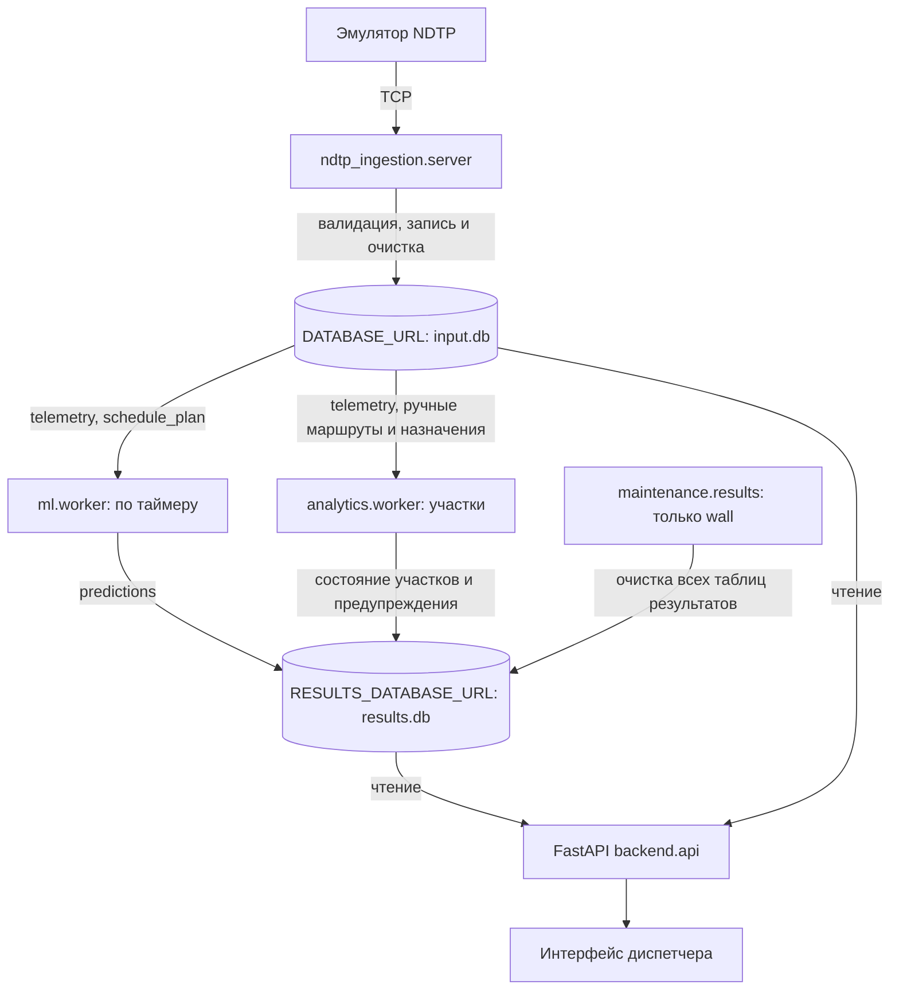

# Delay Prediction Platform

Прогноз задержки автобусов на остановке через 10–15 минут. Модель ДС объединяет бустинги и PyTorch GRU; при ошибке модели работает baseline. Backend показывает готовые прогнозы, не запускает модель по запросу интерфейса.

## Схема



Обработчик `ndtp_ingestion.server` принимает TCP-пакеты эмулятора и пишет в SQLite-базу входных данных. ML worker рассчитывает прогнозы по таймеру; API читает телеметрию и готовые прогнозы. Модель не запускается по HTTP-запросу интерфейса. Детали приёмника, карта устройств и очистка — в [ndtp_ingestion/README.md](ndtp_ingestion/README.md).

## Запуск всего приложения в Docker

Нужны Docker Engine/Docker Desktop и современный Docker Compose v2 или новее
с поддержкой `depends_on.condition`. Python и виртуальное окружение на хосте
не требуются. Команды выполняются из корня репозитория. Первый build скачивает
зависимости; ML работает на CPU. Модель и интерфейс включены в образ приложения,
локальные базы, CSV, `.env` и виртуальные окружения в образ не копируются.

### Шесть работающих контейнеров

| Сервис Compose | Назначение | Данные |
|---|---|---|
| `backend` | FastAPI и интерфейс на http://127.0.0.1:8000 | Читает входные данные и прогнозы; результаты смонтированы только для чтения |
| `worker` | ML по таймеру, по умолчанию каждые 10 с | Читает `input.db`, пишет `results.db` |
| `analytics` | Расчёт состояний участков, норм и предупреждений | Читает телеметрию и ручные маршруты, пишет аналитику в `results.db` |
| `ingestion` | TCP-приёмник NDTP и очистка входных данных | Только `input.db`: `telemetry`, `schedule_plan` |
| `results-maintenance` | Независимая очистка всех шести таблиц результатов | Только `results.db`; у каждой таблицы свой срок хранения и интервал |
| `emulator` | Генерация телеметрии трёх демонстрационных ТС | Отправляет TCP-пакеты в `ingestion:9000` |

Ещё два служебных контейнера **завершаются после подготовки**, а не работают
постоянно: `prepare` создаёт базы/индексы и первоначальный синтетический план;
`emulator-config` ждёт готовности эмулятора и передаёт ему сохранённую конфигурацию.
В `docker compose ps -a` их нормальное состояние — `Exited (0)`.
Ошибка подготовки блокирует запуск зависимых сервисов.

Backend, ML worker, аналитика, приёмник и подготовка используют образ
`delay-prediction-platform:local` с разными командами запуска. Обслуживание использует
отдельный лёгкий образ `delay-results-maintenance:local` (Python + SQLAlchemy),
без пакетов `ml`, `analytics`, NumPy и PyTorch. Его можно запускать и останавливать
независимо от вычислительных процессов; код подключения находится в `storage.database`. Процессы приложения
работают от пользователя `app` (UID 10001), не от root. Эмулятор использует
поставляемый образ `ndtp-telemetry-emulator:1.0`. Контейнеры общаются по внутренней
сети Compose: Docker socket и host networking им не нужны. Наружу опубликован
только HTTP-порт Backend, на `127.0.0.1`; TCP 9000 и REST эмулятора 18080 остаются
внутри сети.

### Живое демо с эмулятором

Если образ эмулятора ещё не установлен, положите архив из раздачи в
`data/dataset/ndtp-telemetry-emulator.tar` и загрузите его один раз:

```bash
docker load -i data/dataset/ndtp-telemetry-emulator.tar
```

Запуск шести сервисов и подготовительных шагов:

```bash
docker compose up -d --build
docker compose ps -a
docker compose logs --tail=50 prepare emulator-config worker
```

Откройте **http://127.0.0.1:8000/**. Через несколько секунд появятся три ТС и
прогнозы. При первом запуске модели может потребоваться больше времени.
`prepare` создаёт искусственное расписание примерно на два часа вперёд;
движение эмулятора случайное, это проверка интеграции, а не точности прогноза.

Если порт 8000 занят локальным запуском:

```bash
PORT=8002 docker compose up -d --build
```

Тогда интерфейс доступен на http://127.0.0.1:8002/. Используйте то же значение
`PORT` в последующих командах, меняющих конфигурацию. Compose автоматически
читает `.env` для подстановок (в отличие от локальных Python-скриптов).
Адреса обеих баз внутри контейнеров заданы в Compose явно, поэтому локальный
`DATABASE_URL` из `.env` не переключит их на другую базу.

### Данные, перезапуск и остановка

Постоянные именованные volumes:

- `input-data`: `/data/input/input.db`, телеметрия и план.
- `results-data`: `/data/results/results.db`, прогнозы.
- `runtime-config`: сохранённые искусственный план, карта устройств и настройки эмулятора.

Имена volumes получают префикс проекта `delay-platform`. Входной volume у
читателей доступен на запись для служебных SQLite WAL/SHM-файлов; HTTP-обработчики
выполняют только чтение. Старые файлы `artifacts/*.db` на хосте автоматически
не импортируются и не изменяются.

```bash
# Остановить и удалить контейнеры/сеть, сохранив данные:
docker compose down
# Запустить снова: существующие базы и CSV не перезаписываются:
docker compose up -d
# Просмотр журналов:
docker compose logs -f worker ingestion results-maintenance
# Перезапустить только ML:
docker compose restart worker
```

`docker compose down -v` **удаляет volumes и данные** — для обычной остановки
флаг `-v` не нужен. У работающих сервисов `restart: unless-stopped`; при штатном
завершении Compose передаёт сигнал остановки и даёт время закрыть процессы.

Эмулятор хранит активную конфигурацию в памяти. После самостоятельного
перезапуска его контейнера или Docker daemon повторно примените сохранённый
конфиг (базы при этом сохраняются):

```bash
docker compose run --rm --no-deps emulator-config
```

При обычном `down` → `up` настройка применяется автоматически. Для нового
искусственного плана после его устаревания можно запустить отдельный проект:
`PORT=8002 docker compose -p delay-fresh up -d`. Он получит новые volumes,
не удаляя историю старого проекта. Чтобы остановить его, используйте то же `-p`.

Параметры в `.env` или окружении: `PORT`, `MODEL_TYPE`, `ML_INTERVAL_S`,
`ML_WINDOW_S`, `PREDICTION_MAX_AGE_SECONDS`, `CLEANUP_INTERVAL_S`,
`TELEMETRY_RETENTION_S`, `SCHEDULE_RETENTION_S`, `PREDICTIONS_RETENTION_S`,
`RESULTS_CLEANUP_INTERVAL_S`. После изменения примените `docker compose up -d`.
Живой Compose всегда использует `DATA_TIME_MODE=wall`.

### Подключение ручных маршрутов к аналитике

При подготовке Compose создаёт также таблицы результатов аналитики. Без ручного
маршрута и назначений ТС новый блок интерфейса показывает пустое состояние.
Синтетический план эмулятора не выдаётся за маршрут: эти определения не импортируются
автоматически. Подготовьте JSON по [инструкции аналитики](analytics/README.md), затем:

```bash
docker compose run --rm --no-deps \
  --volume /absolute/path/to/route.json:/route.json:ro \
  analytics python -m analytics.routes --file /route.json
docker compose logs -f analytics
```

Для уже запущенного проекта с другим именем (например, `delay-live`) добавляйте
`-p delay-live` ко всем командам Compose. Аналитика читает маршруты в следующем
цикле; пересборка образа не нужна.

### Обслуживание базы результатов

**Это отдельный процесс и отдельный контейнер, а не часть ML worker или приёмника.**
Команда запуска — `python -m maintenance.results`. Он работает с `RESULTS_DATABASE_URL`;
при отсутствии адреса поддерживает прежнюю общую базу через `DATABASE_URL`, но
удаляет только записи перечисленных ниже таблиц результатов. Входные таблицы,
определения маршрутов и назначения транспорта не затрагиваются.

| Таблица | Возраст считается по | Срок по умолчанию | Переменная срока хранения |
|---|---|---|---|
| `predictions` | `predicted_at` | 1 сутки | `PREDICTIONS_RETENTION_S=86400` |
| `vehicle_state` | `event_time` | 1 сутки | `VEHICLE_STATE_RETENTION_S=86400` |
| `segment_passages` | `exited_at` | 30 суток | `SEGMENT_PASSAGES_RETENTION_S=2592000` |
| `segment_baseline` | `updated_at` | 30 суток | `SEGMENT_BASELINE_RETENTION_S=2592000` |
| `segment_state` | `calculated_at` | 1 сутки | `SEGMENT_STATE_RETENTION_S=86400` |
| `alerts` | `updated_at` | 7 суток | `ALERTS_RETENTION_S=604800` |

**Срок хранения и частота очистки — разные настройки.** Проверка всех таблиц
выполняется сразу при старте, затем по умолчанию каждые 600 секунд
(`RESULTS_CLEANUP_INTERVAL_S`). Для отдельного расписания задайте
`PREDICTIONS_CLEANUP_INTERVAL_S`, `VEHICLE_STATE_CLEANUP_INTERVAL_S`,
`SEGMENT_PASSAGES_CLEANUP_INTERVAL_S`, `SEGMENT_BASELINE_CLEANUP_INTERVAL_S`,
`SEGMENT_STATE_CLEANUP_INTERVAL_S` или `ALERTS_CLEANUP_INTERVAL_S`.
Неуказанные интервалы наследуют общий. Все значения — положительные конечные
числа в секундах. Пример `.env`:

```dotenv
RESULTS_CLEANUP_INTERVAL_S=600
PREDICTIONS_RETENTION_S=86400
SEGMENT_PASSAGES_RETENTION_S=2592000
SEGMENT_PASSAGES_CLEANUP_INTERVAL_S=3600
ALERTS_RETENTION_S=604800
ALERTS_CLEANUP_INTERVAL_S=300
```

Так прогнозы проверяются раз в 10 минут, история прохождений — раз в час,
предупреждения — раз в 5 минут. Изменения применяются пересозданием только сервиса:

```bash
docker compose up -d --no-deps results-maintenance
docker compose logs -f results-maintenance
# Остановить только обслуживание:
docker compose stop results-maintenance
# Разовый проход по всем таблицам, независимо от их интервалов:
docker compose run --rm --no-deps results-maintenance python -m maintenance.results --once
```

В журнале указываются таблица, число удалённых записей, срок и интервал. При ошибке
одной таблицы остальные продолжают обслуживаться; повтор — через 30 секунд или
раньше, если её интервал меньше. Отсутствующий файл базы не создаётся. Отсутствующие
таблицы пропускаются (поддерживается старая база только с прогнозами). Для новой,
пока неизвестной таблицы выводится предупреждение: нужно явно добавить правило
с её временным полем, произвольные данные автоматически не удаляются.

Удаляются записи **старше** срока; на самой границе запись остаётся. Для предупреждений
учитывается последнее обновление, а не дата первого появления: актуальное предупреждение
сохраняется. После закрытия его время больше не обновляется бесконечно. Записи норм,
которые аналитика продолжает пересчитывать, также остаются актуальными. Удаление
старых прохождений ограничивает историю, по которой пересчитывается норма.

Общий режим времени теперь задаётся `DATA_TIME_MODE=wall|stream`. Если он не указан,
сохраняется совместимость с `ML_TIME_MODE`. В режиме `stream` удаление **полностью
отключено**, в том числе при ручном `--once`; исторический Compose вообще не запускает
обслуживание. Совместимая команда `python -m ml.results_maintenance` оставлена как
переадресация, но новый код не импортирует ML.

Очистка удаляет строки, а не файл базы и не её схему. SQLite переиспользует освобождённые
страницы; размер `.db` на диске не обязан сразу уменьшаться. Автоматический `VACUUM`,
блокирующий запись, не запускается.

### Исторический режим в Docker

Основной режим дальнейшего функционального тестирования — исторический.
Эмулятор используем отдельно для проверки обработки потока в реальном времени.
Исследование восстановления маршрута из плана и GPS, результаты и команда
воспроизведения описаны в [analytics/HISTORICAL_ROUTE.md](analytics/HISTORICAL_ROUTE.md).
Для ТС 122658 подготовлен экспериментальный маршрут и 12 частичных интервалов
назначения, подтверждённых последовательностью GPS-точек. Импорт выполняется
явно по инструкции в отчёте; остальные ТС автоматически к нему не привязываются.

Отдельный файл Compose запускает два постоянных контейнера: `backend` и `replay`,
а также завершающийся `prepare`. Координатор `replay` последовательно вызывает
расчёт ML и аналитики для одного исторического момента, затем публикует это время
для API. Отдельные `worker` и `analytics` нужны в живом режиме; одновременно
запускать их с координатором исторического воспроизведения не нужно.
Приёмника, эмулятора и очистки результатов здесь нет; `DATA_TIME_MODE=stream`.
Проект называется `delay-history`, поэтому volumes отделены от живого режима.
CSV из `data/dataset` монтируются только для чтения и импортируются лишь при
отсутствии входной базы. Если файл базы есть, но схема повреждена, подготовка
завершается ошибкой вместо перезаписи.

```bash
# Порт 8002 позволяет работать одновременно с живым демо:
PORT=8002 docker compose -f compose.historical.yaml up -d --build --remove-orphans
PORT=8002 docker compose -f compose.historical.yaml ps -a
# Остановка с сохранением исторических данных:
PORT=8002 docker compose -f compose.historical.yaml down
```

`--remove-orphans` при обновлении убирает прежние контейнеры исторических
`worker`/`analytics`; volumes и результаты сохраняются.

Откройте **http://localhost:8002**. Над обзором транспорта появились:

- **«С начала»** — новый запуск с первой точки телеметрии;
- поле **«Начать с момента (UTC)»** и **«Продолжить с этого времени»** — новый
  запуск с выбранного момента. Для маршрута ТС 122658 попробуйте
  `2026-01-06 07:23:00` UTC (на карте это 10:23 по Москве).

Первый запуск начинается с первой записи автоматически. Обычный перезапуск
контейнера **продолжает сохранённое время**, а не возвращает к началу и не
перепрыгивает к концу базы. Новый запуск с начала/выбранного момента создаёт
`replay-<session>.db` рядом с настроенным `RESULTS_DATABASE_URL`. Старый
`results.db` и предыдущие файлы воспроизведения не удаляются. Активны две базы:
неизменяемая входная и результаты выбранного запуска. Новые таблицы не добавлены.
Маршруты и назначения остаются во входной базе и сохраняются при переключении.

Состояние часов и команды хранятся в `runtime-config`, каталог
`REPLAY_STATE_DIR=/data/runtime/replay`. API читает результаты только выбранного
запуска и только до опубликованного времени; прогнозы из будущего не показываются.
Если расчёт падает, время не продвигается, шаг повторяется после восстановления.
После конца истории часы останавливаются. Очистка исторических результатов
отключена, поэтому старые запуски занимают место до их явного удаления владельцем.

По умолчанию шаг `REPLAY_STEP_S=10` исторических секунд, пауза между успешными
шагами `REPLAY_TICK_S=1` реальная секунда; фактическая скорость зависит от времени
расчёта. Шаг ограничен 60 секундами. Эти переменные задаются в `.env` для Compose.
Паузы и ползунка времени в минимальной версии нет. Перемотка запускает расчёты с
чистым состоянием: накопленные нормы аналитики будут заполняться заново.

Те же команды доступны через API:

```bash
curl http://localhost:8002/replay/status
curl -X POST http://localhost:8002/replay/start -H 'Content-Type: application/json' -d '{}'
curl -X POST http://localhost:8002/replay/start -H 'Content-Type: application/json' \
  -d '{"at":"2026-01-06T07:23:00Z"}'
```

POST лишь передаёт команду координатору (202); HTTP-обработчик не запускает модель
и не пишет в базы. В живом режиме команды недоступны. Часовой пояс в API обязателен,
время вне диапазона истории отклоняется. Времена CSV без пояса по-прежнему считаются UTC.

Для локального запуска на Linux после подготовки исторических баз:
`DATA_TIME_MODE=stream python scripts/run_demo.py --replay --port 8002`.
Нужны оба URL баз; каталог часов по умолчанию `artifacts/replay-clock`.
Без `--replay`/`REPLAY_STATE_DIR` прежние локальные команды сохраняют режим снимка
на последнюю точку базы. На Windows используйте Docker.

Исходные CSV должны присутствовать в `data/dataset/validate/`. Подготовка новой
базы выполняется во временном файле и публикуется только после успешного импорта.
Перед запуском worker/API всегда проверяется и создаётся схема результатов.
Схема ожидания готовности использует стандартные условия Compose
[`service_healthy` и `service_completed_successfully`](https://docs.docker.com/compose/how-tos/startup-order/).

## Первый запуск после клонирования

Нужны Python **3.12** с `venv`, работающий Docker и несколько гигабайт свободного места. На Linux также нужна библиотека OpenMP (`libgomp1` в Debian/Ubuntu). Архив эмулятора `ndtp-telemetry-emulator.tar` получите из исходной раздачи и положите в `data/dataset/`: в Git его нет. Веса ML-моделей уже включены в репозиторий, обучение не требуется.

```bash
git clone https://github.com/valentinesvev/delay_prediction_platform.git
cd delay_prediction_platform
python3.12 -m venv .venv
bash scripts/setup_and_run.sh --install --mode emulator --demo-plan
```

Первая установка скачивает зависимости и может занять значительное время. Если `.venv` уже настроена, повторно создавать её и передавать `--install` не нужно — используйте команду ниже. Docker должен быть доступен текущему пользователю без запуска всего приложения через `sudo`.

## Быстрый запуск в существующем окружении

Проверенная конфигурация: Linux, Python **3.12**, существующая `.venv`. Скрипт проверяет зависимости, но по умолчанию ничего не скачивает. `.env` автоматически не загружается.

```bash
# Живой TCP-поток от эмулятора, искусственный план для проверки интеграции:
bash scripts/setup_and_run.sh --mode emulator --demo-plan
```

Откройте **http://127.0.0.1:8000/**. На экране: ТС со свежей телеметрией, состояние относительно плана, скорость, оценка текущей задержки, ближайшая/следующая остановка, прогноз и остановка прогноза. Данные обновляются каждые 5 с; ML в этом режиме — каждые 10 с (переопределяется `ML_INTERVAL_S`). Отсутствующий прогноз не скрывает ТС.

Нужен работающий Docker, доступный текущему пользователю, и образ `ndtp-telemetry-emulator:1.0` либо локальный `data/dataset/ndtp-telemetry-emulator.tar`. Скрипт сам загрузит архив при необходимости. Используются порты 8000, 9000 и 18080. Автоматическое управление контейнером поддержано на Linux; для внешнего эмулятора есть `--no-emulator`. Остановка — Ctrl+C.

**Демонстрационное расписание искусственное, движение эмулятора случайное.** Оно нужно для проверки потока данных, а не оценки точности модели. Историческая телеметрия в режиме emulator не импортируется; файлы баз сохраняются между запусками, CSV повторно не загружается. Чтобы получить новый искусственный план после его устаревания, укажите новый файл `--db`. Для настоящего расписания:

```bash
bash scripts/setup_and_run.sh --mode emulator \
  --schedule /path/to/current-plan.csv \
  --unit-map /path/to/units.json \
  --emulator-config /path/to/emulator.json
```

Карта устройств — JSON `unit_id → tr_id`, план — актуальные времена UTC и координаты. Идентификаторы нельзя приравнивать без карты. Настройки, формат CSV и пример конфигурации — в [инструкции обработчика](ndtp_ingestion/README.md).

```bash
# Историческая проверка ML: загрузить CSV только при отсутствии artifacts/input.db:
bash scripts/setup_and_run.sh --mode historical
# Тесты перед запуском (без переустановки):
bash scripts/setup_and_run.sh --mode emulator --demo-plan --test
# Установить отсутствующие пакеты — только по явному запросу, нужен интернет:
bash scripts/setup_and_run.sh --install --mode historical
# Все параметры:
bash scripts/setup_and_run.sh --help
```

Оценка текущей задержки строится по GPS и плану, а не передаётся эмулятором. При недостатке данных показывается «—». «На линии по плану» — состояние по доступной телеметрии/плану, не подтверждение выпуска диспетчером. Номера маршрутов в текущем контракте нет; показывается ID ТС. Остановка отображается по адресу из плана либо ID.

Приёмник очищает только входную базу: телеметрия хранится 2 часа по времени получения, прошедшие строки плана — 6 часов по плановому времени. Отдельный процесс `maintenance.results` очищает все таблицы результатов по правилам из раздела «Обслуживание базы результатов» выше. Сроки настраиваются в `.env.example` и передаются переменными окружения. Исторический режим приёмник и очистку не запускает.

Старое тестовое демо с отдельными `backend/prediction_worker.py`, `data/ingestion.py`, `data/storage.py` и `ml/pipeline.py` удалено. Исторический режим выше использует актуальные ML-модели и две базы, поэтому сохраняется как самостоятельная проверка без эмулятора.

Если HTTP-порт занят, добавьте `--port 8002` и откройте `http://127.0.0.1:8002/`. Порты приёмника и REST эмулятора задаются через `NDTP_PORT` и `EMULATOR_API_PORT`. Для своего конфига эмулятора `targetPort` должен совпадать с `NDTP_PORT`. При запуске с `--demo-plan` конфиг формируется автоматически.

## Локальный запуск на исторических данных

Ручная альтернатива скрипту, из корня репозитория, Python 3.12:

```bash
python -m venv .venv
source .venv/bin/activate
# Linux: CPU-версия PyTorch без загрузки CUDA-зависимостей.
if [ "$(uname)" = "Linux" ]; then
  python -m pip install torch --index-url https://download.pytorch.org/whl/cpu
fi
python -m pip install -r requirements.txt
mkdir -p artifacts
[ -f artifacts/input.db ] || python -m ml.csv_to_db --data data/dataset --url sqlite:///artifacts/input.db
export DATABASE_URL=sqlite:///artifacts/input.db
export RESULTS_DATABASE_URL=sqlite:///artifacts/results.db
export DATA_TIME_MODE=stream
python -m ml.results_db
python scripts/run_demo.py
```

На Windows активируйте виртуальное окружение своей командой, затем задайте `DATABASE_URL`, `RESULTS_DATABASE_URL` и `DATA_TIME_MODE` средствами вашей оболочки. Откройте `http://127.0.0.1:8000/`, API доступен в `/docs`. `ml.csv_to_db` **заменяет** таблицы `telemetry` и `schedule_plan` по переданному URL; не запускайте повторную загрузку в базу с нужной вам живой историей. Файл `artifacts/input.db` не коммитится.
На macOS обычная установка `requirements.txt` установит сборку PyTorch для macOS. Для первого запуска потребуются загрузка библиотек и несколько гигабайт свободного места.

Для одного цикла без постоянного процесса:

```bash
python -m ml.worker --once
```

Для живого потока установите `DATA_TIME_MODE=wall` и подайте во входную базу свежую валидированную телеметрию и актуальный план. Без этих таблиц worker не сможет рассчитать прогноз. `ML_INTERVAL_S` (по умолчанию 30 секунд) задаёт интервал расчётов, `PREDICTION_MAX_AGE_SECONDS` (90 секунд) — порог свежести API. Образец настроек — `.env.example`; этот файл автоматически не загружается. Имена таблиц/полей для ML настраиваются в `ml.db.DBConfig`.

## HTTP API бэкенда

- `GET /vehicles/active` — ТС с телеметрией не старше 120 с, текущая оценка задержки, остановки и готовый прогноз. При воспроизведении используется общий исторический курсор; без него в `stream` — последняя историческая точка, в `wall` — текущий UTC.
- `GET /health` — жив ли HTTP-процесс; это не проверка модели и базы.
- `GET /predictions/latest` — список последних сохранённых прогнозов, по одному на `tr_id`. Пока записей нет: `{"status":"unavailable","predictions":[]}`; если все записи устарели, общий статус — `stale`.
- `GET /predictions/{tr_id}/latest` — последняя запись одного ТС; 404, если её нет.
- `GET /analytics/segments` — последнее рассчитанное состояние каждого вручную заданного участка.
- `GET /analytics/alerts` — активные предупреждения по участкам.

Ответ содержит `t_forecast`, `predicted_at`, `target_stop_id`, `target_time_plan`, `predicted_delay_s`, `predicted_arrival`, `interval_lo_s`, `interval_hi_s`, `model_used`, `fallback_reason`, `degraded` и `status` (`ready`/`stale`). Времена API представлены ISO 8601 UTC; свежесть определяется по более старому из `t_forecast` и `predicted_at`. При недоступности настроенной БД API возвращает 503. Исторические прогнозы в режиме реплея закономерно отображаются как `stale`.

Отдельный `ml.service` на порту 8001 предоставляет `POST /predict`, `POST /predict/batch` для ручной проверки модели без БД и `POST /predict/from-db` для принудительного цикла (параметр `write=false` отключает запись). Постоянный цикл выполняет `ml.worker`; бэкенд напрямую к `ml.service` не обращается. Подробности модели и метрики — в [README_ML.md](README_ML.md).

## Работа в команде

Работайте в отдельной ветке. Перед началом обновите `main`, затем подтяните его изменения в свою ветку; изменения отправляйте через Pull Request:

```bash
git switch main
git pull
git switch -c feature/название
# после изменений
git add .
git commit -m "Описание изменений"
git push -u origin feature/название
```

Если ветка уже создана, вместо `git switch -c` используйте `git switch feature/название` и `git merge main`. Новые библиотеки вносите в `requirements-ml.txt` (ML/рабочий запуск) или `requirements.txt` (инструменты проверки).

Тесты: `python -m pytest -q`. Дополнительно см. [backend/README.md](backend/README.md).


## Диспетчерский экран с картой

Для аналитики участков теперь есть отдельный процесс, который читает входную базу и пишет готовые метрики во вторую базу. Как задать маршрут, назначить автобусы и запустить расчёт, описано в [analytics/README.md](analytics/README.md). Блок «Где движение замедляется» обращается к `/analytics/segments` и `/analytics/alerts`. Если аналитика ещё не подготовлена, основная карта транспорта продолжает работать.

Инструкция фронтендеру, контракт API и порядок добавления новых запросов — [frontend/README.md](frontend/README.md).

Основной экран — **http://127.0.0.1:8000/**. Старый табличный интерфейс удалён. Адреса `/dispatcher` и `/dispatcher/` перенаправляют на главную страницу.

```bash
bash scripts/setup_and_run.sh --mode emulator --demo-plan
```

Интерфейс раз в 5 секунд обращается к **`GET /vehicles/active`**. FastAPI читает общую БД: последние достоверные координаты и треки из `telemetry`, остановки из `schedule_plan`, готовые ML-прогнозы из `predictions`. HTTP-запрос не запускает модель и не записывает данные в БД. Прогноз рассчитывает отдельный воркер. Статическая запись `replay.json` больше не используется, `/dispatcher/replay` удалён.

Карта и карточки показывают ID ТС, GPS за последние 10 минут, ближайшие/следующие точки расписания, оценку текущей задержки по GPS, прогноз задержки и прибытия, интервал, модель и свежесть расчёта. Разрывы GPS более 90 с и невалидные точки не соединяются линиями. В `position`, точках `track`, остановках `stops` и `prediction.target_position` координаты идут как **[latitude, longitude]**. Времена API — ISO UTC, отображение — московское время.

Красный сигнал означает, что текущая оценка задержки достигла выбранного порога; жёлтый — что порога достиг свежий прогноз. Вероятности пробок, причины задержки и поломки не выдумываются. Устаревший прогноз показывается справочно с пометкой, baseline и неполная телеметрия обозначаются отдельно. ТС без прогноза видны в фильтре «Все», выбранном по умолчанию. ТС без достоверной точки за последние 120 с исключаются после обновления.

Сохранены поиск, условные географические зоны, пороги 2/5/10 минут, выбор транспорта и слоёв, переключение подложки и разворачивание карты. Встроенные демонстрационные сценарии и проигрывание статической записи убраны. При ошибке API последние данные остаются с предупреждением, запросы не накладываются, таймаут — 10 секунд. Для картографических библиотек и подложек нужен интернет; при недоступной карте список продолжает работать.

Исторический Docker-режим поддерживает воспроизведение с выбором начального времени.
Прежний локальный `--mode historical` без `run_demo.py --replay` показывает снимок
на последнюю точку базы. Режим и искусственное расписание `--demo-plan` явно
отмечаются над картой. Файлы независимого макета `Frontend Test` сохранены как
исходный материал и не обслуживаются приложением.

Проверки: `python -m pytest -q`, а для логики клиента (Node.js 22+, без npm-зависимостей) — `node --test tests/dispatcher-data.test.cjs tests/dispatcher-ui.test.cjs`.


## Две базы: запуск и перенос

`setup.py` использует `artifacts/input.db` (historical) либо `artifacts/live-input.db`
(emulator), а для результатов — `artifacts/results.db` либо `artifacts/live-results.db`
соответственно. Это отделяет исторические результаты от живой очистки. Пути переопределяются
`--db` и `--results-db`; они должны различаться. `run_demo.py` использует адреса
из окружения, проверяет входные таблицы и выполняет идемпотентную инициализацию
результатов **до** запуска worker и API. Без `RESULTS_DATABASE_URL` старые команды
продолжают работать с одной базой. Приёмник и в этом режиме не создаёт и не очищает
`predictions`: за неё отвечают инициализация/ML и отдельное обслуживание.

Порядок отдельного запуска процессов после подготовки входных данных:

```bash
export DATABASE_URL=sqlite:///artifacts/input.db
export RESULTS_DATABASE_URL=sqlite:///artifacts/results.db
export DATA_TIME_MODE=stream  # wall для живого потока
python -m ml.results_db
python -m analytics.results
# В отдельных терминалах с теми же переменными:
python -m ml.worker
python -m analytics.worker
python -m uvicorn backend.api:app --host 127.0.0.1 --port 8000
# Только в живом режиме:
python -m maintenance.results
# Приёмник требует NDTP_UNIT_MAP; создаёт только входные таблицы:
python -m ndtp_ingestion.server
```

Инициализация создаёт `predictions`, уникальность `(tr_id, t_forecast, target_stop_id)`
и индексы, включая `predicted_at`, без удаления записей. Worker и ручной
`POST /predict/from-db` используют одинаковое разделение баз. API соединяет данные
по `tr_id` в Python; JSON интерфейса сохранён. При отсутствии файла/таблицы или
ошибке доступа настроенной базы результатов API возвращает HTTP 503, не создавая
файл. Worker логирует ошибку и повторяет цикл с задержкой до 60 секунд.
`/health` проверяет только HTTP-процесс. В режиме `stream` обслуживание результатов
не удаляет записи даже при ручном запуске; ML никогда не выполняет очистку.

Для переноса старой общей базы:

1. Остановите worker, приёмник, API и обслуживание. Сделайте резервную копию через
   SQLite backup (например, `sqlite3 artifacts/demo.db '.backup artifacts/demo-backup.db'`);
   обычное копирование одного `.db` при активном WAL недостаточно.
2. Сохраните старую базу как входную; не запускайте повторный CSV-импорт.
3. Выполните:

```bash
export DATABASE_URL=sqlite:///artifacts/demo.db
export RESULTS_DATABASE_URL=sqlite:///artifacts/results.db
export DATA_TIME_MODE=stream
python -m ml.results_db
python -m ml.migrate_predictions --source sqlite:///artifacts/demo.db
python scripts/run_demo.py
```

Перенос читает источник только для чтения, копирует прогнозы одной транзакцией и
проверяет все поля каждой строки по уникальному ключу. `id` назначается в целевой
базе заново. Команда выводит `source_rows_verified` и `inserted`; повторный запуск
должен показать `inserted: 0`. При различающихся данных одного ключа перенос
откатывается с ошибкой, ничего не перезаписывает. Старые `predictions` остаются
в исходной базе и автоматически не удаляются. Для отката остановите процессы и
уберите `RESULTS_DATABASE_URL` (новые прогнозы из отдельной базы назад автоматически
не переносятся). Для большой истории учитывайте, что перенос читает её в память.
