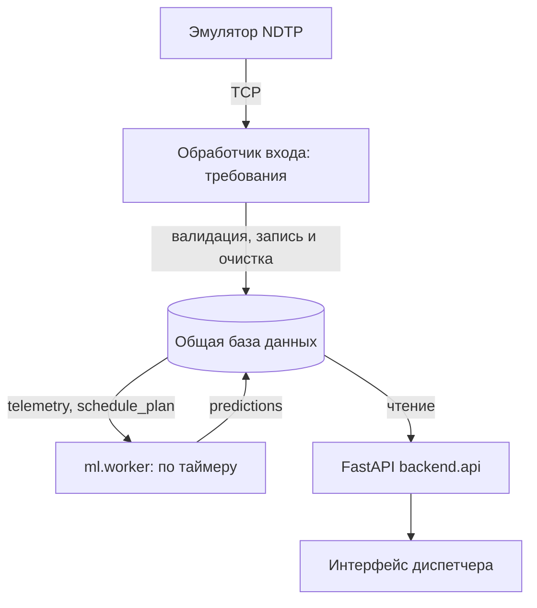

# Delay Prediction Platform

Прогноз задержки автобусов на остановке через 10–15 минут. Модель ДС объединяет бустинги и PyTorch GRU; при ошибке модели работает baseline. Backend показывает готовые прогнозы, не запускает модель по запросу интерфейса.

## Схема



Обработчик NDTP ещё **не реализован**. Пока для проверки база заполняется историческими CSV с помощью `ml.csv_to_db`. Контракт обработчика описан в [backend/INGESTION_REQUIREMENTS.md](backend/INGESTION_REQUIREMENTS.md). В рабочей базе нужны три основные таблицы: `telemetry` (проверенные точки), `schedule_plan` (план без факта прибытия), `predictions` (история прогнозов). Время в базе трактуется как UTC; задержки указаны в секундах. ML worker добавляет записи в `predictions`; очистка всей устаревшей истории относится к будущему обработчику входа. Во время инференса признаки не сохраняются в БД: CSV в `artifacts/features/` создаются только отдельной командой подготовки обучения.

## Локальный запуск на исторических данных

Из корня репозитория, Python 3.12+:

```bash
python -m venv .venv
source .venv/bin/activate
# Linux: CPU-версия PyTorch без загрузки CUDA-зависимостей.
if [ "$(uname)" = "Linux" ]; then
  python -m pip install torch --index-url https://download.pytorch.org/whl/cpu
fi
python -m pip install -r requirements.txt
mkdir -p artifacts
python -m ml.csv_to_db --data data/dataset --url sqlite:///artifacts/demo.db
export DATABASE_URL=sqlite:///artifacts/demo.db
export ML_TIME_MODE=stream
python scripts/run_demo.py
```

На Windows активируйте виртуальное окружение своей командой, затем задайте `DATABASE_URL` и `ML_TIME_MODE` средствами вашей оболочки. Откройте `http://127.0.0.1:8000/`, API доступен в `/docs`. `ml.csv_to_db` **заменяет** таблицы `telemetry` и `schedule_plan` по переданному URL; не запускайте повторную загрузку в базу с нужной вам живой историей. Файл `artifacts/demo.db` не коммитится.
На macOS обычная установка `requirements.txt` установит сборку PyTorch для macOS. Для первого запуска потребуются загрузка библиотек и несколько гигабайт свободного места.

Для одного цикла без постоянного процесса:

```bash
python -m ml.worker --once
```

Для живого потока установите `ML_TIME_MODE=wall` и подайте в общую базу свежую валидированную телеметрию и актуальный план. Без этих таблиц worker не сможет рассчитать прогноз. `ML_INTERVAL_S` (по умолчанию 30 секунд) задаёт интервал расчётов, `PREDICTION_MAX_AGE_SECONDS` (90 секунд) — порог свежести API. Образец настроек — `.env.example`; этот файл автоматически не загружается. Имена таблиц/полей для ML настраиваются в `ml.db.DBConfig`.

## HTTP API бэкенда

- `GET /health` — жив ли HTTP-процесс; это не проверка модели и базы.
- `GET /predictions/latest` — список последних сохранённых прогнозов, по одному на `tr_id`. Пока записей нет: `{"status":"unavailable","predictions":[]}`; если все записи устарели, общий статус — `stale`.
- `GET /predictions/{tr_id}/latest` — последняя запись одного ТС; 404, если её нет.

Ответ содержит `t_forecast`, `predicted_at`, `target_stop_id`, `target_time_plan`, `predicted_delay_s`, `predicted_arrival`, `interval_lo_s`, `interval_hi_s`, `model_used`, `fallback_reason`, `degraded` и `status` (`ready`/`stale`). Времена API представлены ISO 8601 UTC; свежесть определяется по более старому из `t_forecast` и `predicted_at`. При недоступности настроенной БД API возвращает 503. Исторические прогнозы в режиме реплея закономерно отображаются как `stale`.

Отдельный `ml.service` на порту 8001 предоставляет `POST /predict`, `POST /predict/batch` для ручной проверки модели без БД и `POST /predict/from-db` для принудительного цикла (параметр `write=false` отключает запись). Постоянный цикл выполняет `ml.worker`; бэкенд напрямую к `ml.service` не обращается. Подробности модели и метрики — в [README_ML.md](README_ML.md).

## Работа в команде

Работайте в отдельной ветке. Перед началом обновите `main`, затем подтяните его изменения в свою ветку; изменения отправляйте через Pull Request:

```bash
git switch main
git pull
git switch -c feature/название
# после изменений
git add .
git commit -m "Описание изменений"
git push -u origin feature/название
```

Если ветка уже создана, вместо `git switch -c` используйте `git switch feature/название` и `git merge main`. Новые библиотеки вносите в `requirements-ml.txt` (ML/рабочий запуск) или `requirements.txt` (инструменты проверки).

Тесты: `python -m pytest -q`. Дополнительно см. [backend/README.md](backend/README.md).
