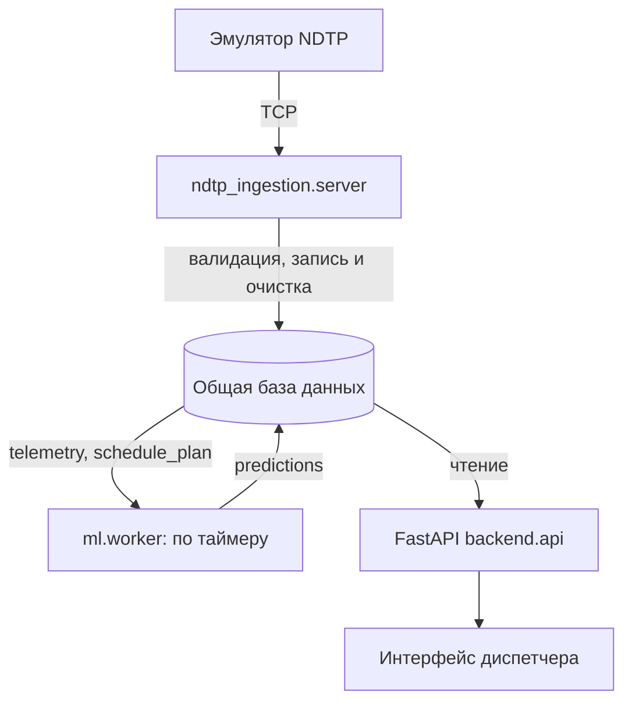

# Delay Prediction Platform

Прогноз задержки автобусов на остановке через 10–15 минут. Модель ДС объединяет бустинги и PyTorch GRU; при ошибке модели работает baseline. Backend показывает готовые прогнозы, не запускает модель по запросу интерфейса.

## Схема



Обработчик `ndtp_ingestion.server` принимает TCP-пакеты эмулятора и пишет в общую SQLite-базу. ML worker рассчитывает прогнозы по таймеру; API читает телеметрию и готовые прогнозы. Модель не запускается по HTTP-запросу интерфейса. Детали приёмника, карта устройств и очистка — в [ndtp_ingestion/README.md](ndtp_ingestion/README.md).

## Быстрый запуск в существующем окружении

Проверенная конфигурация: Linux, Python **3.12**, существующая `.venv`. Скрипт проверяет зависимости, но по умолчанию ничего не скачивает. `.env` автоматически не загружается.

```bash
# Живой TCP-поток от эмулятора, искусственный план для проверки интеграции:
bash scripts/setup_and_run.sh --mode emulator --demo-plan
```

Откройте **http://127.0.0.1:8000/**. На экране: ТС со свежей телеметрией, состояние относительно плана, скорость, оценка текущей задержки, ближайшая/следующая остановка, прогноз и остановка прогноза. Данные обновляются каждые 5 с; ML в этом режиме — каждые 10 с (переопределяется `ML_INTERVAL_S`). Отсутствующий прогноз не скрывает ТС.

Нужен работающий Docker, доступный текущему пользователю, и образ `ndtp-telemetry-emulator:1.0` либо локальный `data/dataset/ndtp-telemetry-emulator.tar`. Скрипт сам загрузит архив при необходимости. Используются порты 8000, 9000 и 18080. Автоматическое управление контейнером поддержано на Linux; для внешнего эмулятора есть `--no-emulator`. Остановка — Ctrl+C.

**Демонстрационное расписание искусственное, движение эмулятора случайное.** Оно нужно для проверки потока данных, а не оценки точности модели. Историческая телеметрия в режиме emulator не импортируется; новая демонстрационная база создаётся отдельно при каждом запуске. Для настоящего расписания:

```bash
bash scripts/setup_and_run.sh --mode emulator \
  --schedule /path/to/current-plan.csv \
  --unit-map /path/to/units.json \
  --emulator-config /path/to/emulator.json
```

Карта устройств — JSON `unit_id → tr_id`, план — актуальные времена UTC и координаты. Идентификаторы нельзя приравнивать без карты. Настройки, формат CSV и пример конфигурации — в [инструкции обработчика](ndtp_ingestion/README.md).

```bash
# Прежнее демо: загрузить CSV только при отсутствии artifacts/demo.db:
bash scripts/setup_and_run.sh --mode historical
# Тесты перед запуском (без переустановки):
bash scripts/setup_and_run.sh --mode emulator --demo-plan --test
# Установить отсутствующие пакеты — только по явному запросу, нужен интернет:
bash scripts/setup_and_run.sh --install --mode historical
# Все параметры:
bash scripts/setup_and_run.sh --help
```

Оценка текущей задержки строится по GPS и плану, а не передаётся эмулятором. При недостатке данных показывается «—». «На линии по плану» — состояние по доступной телеметрии/плану, не подтверждение выпуска диспетчером. Номера маршрутов в текущем контракте нет; показывается ID ТС. Остановка отображается по адресу из плана либо ID.

Очистка запускается приёмником на старте и каждые **10 минут**: телеметрия хранится 2 часа по времени получения, прошедшие строки плана — 6 часов по плановому времени, прогнозы — сутки по времени расчёта. Сроки настраиваются в `.env.example` и передаются переменными окружения. Исторический режим приёмник и очистку не запускает.

## Локальный запуск на исторических данных

Ручная альтернатива скрипту, из корня репозитория, Python 3.12:

```bash
python -m venv .venv
source .venv/bin/activate
# Linux: CPU-версия PyTorch без загрузки CUDA-зависимостей.
if [ "$(uname)" = "Linux" ]; then
  python -m pip install torch --index-url https://download.pytorch.org/whl/cpu
fi
python -m pip install -r requirements.txt
mkdir -p artifacts
python -m ml.csv_to_db --data data/dataset --url sqlite:///artifacts/demo.db
export DATABASE_URL=sqlite:///artifacts/demo.db
export ML_TIME_MODE=stream
python scripts/run_demo.py
```

На Windows активируйте виртуальное окружение своей командой, затем задайте `DATABASE_URL` и `ML_TIME_MODE` средствами вашей оболочки. Откройте `http://127.0.0.1:8000/`, API доступен в `/docs`. `ml.csv_to_db` **заменяет** таблицы `telemetry` и `schedule_plan` по переданному URL; не запускайте повторную загрузку в базу с нужной вам живой историей. Файл `artifacts/demo.db` не коммитится.
На macOS обычная установка `requirements.txt` установит сборку PyTorch для macOS. Для первого запуска потребуются загрузка библиотек и несколько гигабайт свободного места.

Для одного цикла без постоянного процесса:

```bash
python -m ml.worker --once
```

Для живого потока установите `ML_TIME_MODE=wall` и подайте в общую базу свежую валидированную телеметрию и актуальный план. Без этих таблиц worker не сможет рассчитать прогноз. `ML_INTERVAL_S` (по умолчанию 30 секунд) задаёт интервал расчётов, `PREDICTION_MAX_AGE_SECONDS` (90 секунд) — порог свежести API. Образец настроек — `.env.example`; этот файл автоматически не загружается. Имена таблиц/полей для ML настраиваются в `ml.db.DBConfig`.

## HTTP API бэкенда

- `GET /vehicles/active` — ТС с телеметрией не старше 120 с, текущая оценка задержки, остановки и готовый прогноз. В `stream` время отсчитывается от последней исторической точки, в `wall` — от текущего UTC.
- `GET /health` — жив ли HTTP-процесс; это не проверка модели и базы.
- `GET /predictions/latest` — список последних сохранённых прогнозов, по одному на `tr_id`. Пока записей нет: `{"status":"unavailable","predictions":[]}`; если все записи устарели, общий статус — `stale`.
- `GET /predictions/{tr_id}/latest` — последняя запись одного ТС; 404, если её нет.

Ответ содержит `t_forecast`, `predicted_at`, `target_stop_id`, `target_time_plan`, `predicted_delay_s`, `predicted_arrival`, `interval_lo_s`, `interval_hi_s`, `model_used`, `fallback_reason`, `degraded` и `status` (`ready`/`stale`). Времена API представлены ISO 8601 UTC; свежесть определяется по более старому из `t_forecast` и `predicted_at`. При недоступности настроенной БД API возвращает 503. Исторические прогнозы в режиме реплея закономерно отображаются как `stale`.

Отдельный `ml.service` на порту 8001 предоставляет `POST /predict`, `POST /predict/batch` для ручной проверки модели без БД и `POST /predict/from-db` для принудительного цикла (параметр `write=false` отключает запись). Постоянный цикл выполняет `ml.worker`; бэкенд напрямую к `ml.service` не обращается. Подробности модели и метрики — в [README_ML.md](README_ML.md).

## Работа в команде

Работайте в отдельной ветке. Перед началом обновите `main`, затем подтяните его изменения в свою ветку; изменения отправляйте через Pull Request:

```bash
git switch main
git pull
git switch -c feature/название
# после изменений
git add .
git commit -m "Описание изменений"
git push -u origin feature/название
```

Если ветка уже создана, вместо `git switch -c` используйте `git switch feature/название` и `git merge main`. Новые библиотеки вносите в `requirements-ml.txt` (ML/рабочий запуск) или `requirements.txt` (инструменты проверки).

Тесты: `python -m pytest -q`. Дополнительно см. [backend/README.md](backend/README.md).
