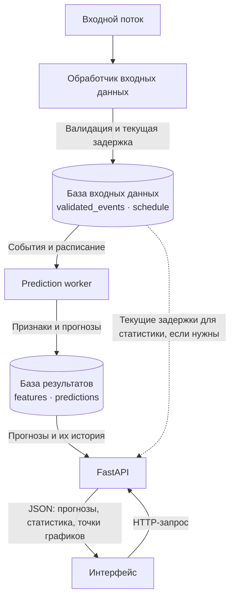

# Backend: общая схема

Сервис состоит из трёх независимых процессов: обработчика входного потока,
worker расчёта прогнозов и FastAPI. Интерфейс обращается к FastAPI по HTTP.
Ниже — задуманная архитектура; упрощения текущего демо перечислены в конце.

## 1. Обработчик входных данных

Отдельный постоянно работающий процесс (`data/ingestion.py`). Получает
входной поток, проверяет данные и сразу рассчитывает текущую задержку.
Сохраняет валидированные события в `validated_events` базы входных данных.
В этой же базе хранится расписание в `schedule`.

Обработчик удаляет старые события по настраиваемому сроку хранения.
Источник потока, способ загрузки расписания и правила его обновления
ещё предстоит определить. Очистка расписания должна сохранять будущие рейсы.

## 2. Prediction worker

Отдельный постоянно работающий процесс (`backend/prediction_worker.py`).
Автоматически запускает расчёт раз в заданный интервал, независимо от
запросов интерфейса.

Один цикл:

1. Читает валидированные события и необходимое расписание из входной базы.
2. `generate_features(...)` формирует признаки для модели.
3. `predict(...)` рассчитывает прогноз по признакам и необходимой истории.
4. Сохраняет признаки в `features`, а прогноз в `predictions` одной базы
   результатов. Запись признаков и прогноза выполняется одной транзакцией.
5. Удаляет устаревшие результаты по настраиваемому сроку хранения.

У прогноза сохраняются `predicted_at` — время расчёта и `data_as_of` — время
использованных входных данных. API возвращает эти значения без изменения.
При ошибке расчёта частичный результат не публикуется, предыдущий остаётся
доступным до истечения срока хранения.

Интервал расчёта, окно истории для модели и срок хранения — разные настройки.
Срок хранения должен покрывать необходимую историю. Циклы не перекрываются;
если расчёт занимает больше интервала, пропущенные запуски не накапливаются.
Состав признаков, модель и необходимое окно истории ещё предстоит определить.

## 3. FastAPI и интерфейс

FastAPI (`backend/api.py`, обработчики в `backend/endpoints.py`) принимает
HTTP-запросы, читает базы и возвращает JSON. Может рассчитывать статистику
по сохранённым данным. Запросы интерфейса не запускают worker или модель.
Базы со стороны API открываются только для чтения.

Интерфейс отображает прогноз, запрашивает статистику и, когда появятся
графики, строит их по точкам из API. История прогнозов берётся из базы
результатов; статистика текущих задержек при необходимости — из входной базы.

Пока worker считает новый прогноз, API может отдавать предыдущий завершённый.
Свежесть оценивается по времени расчёта и входных данных. Если данных нет
или они устарели, интерфейс показывает отсутствие актуального прогноза.
Числовой fallback и ограничение времени выполнения модели пока не определены.

## Что реализовано в учебном демо

Схема трёх процессов и двух SQLite-баз уже работает:

- Обработчик раз в секунду генерирует числа 0, 1, 2, …; текущая задержка
  всегда 0, `schedule` пустая. Счётчик сохраняется между перезапусками.
- Worker раз в 3 секунды берёт последнее входное число. Учебные признаки
  и прогноз повторяют его без преобразований.
- FastAPI отдаёт страницу, последний прогноз и среднее последних 10
  сохранённых значений `state`. Страница обновляет текущее число раз
  в секунду, а среднее запрашивает по нажатию кнопки.

| Запрос | Результат |
|---|---|
| `GET /` | Интерфейс демо |
| `GET /health` | Доступность API; не проверяет остальные процессы |
| `GET /predictions/latest` | Последний прогноз, его время и статус `ready`, `stale` или `unavailable` |
| `GET /predictions/average` | Среднее `state` последних 10 записей по `id`: `average`, `count`, `status` |

Последний прогноз считается устаревшим через 15 секунд после расчёта или
времени входных данных. Среднее — статистика сохранённой истории без проверки
свежести: если записей меньше 10, используются все доступные; если их нет,
ответ содержит `average: null`, `count: 0`, `status: unavailable`.

Запуск и настройки описаны в [корневом README](../README.md).
Документация доступных HTTP-запросов после запуска: `/docs`.
